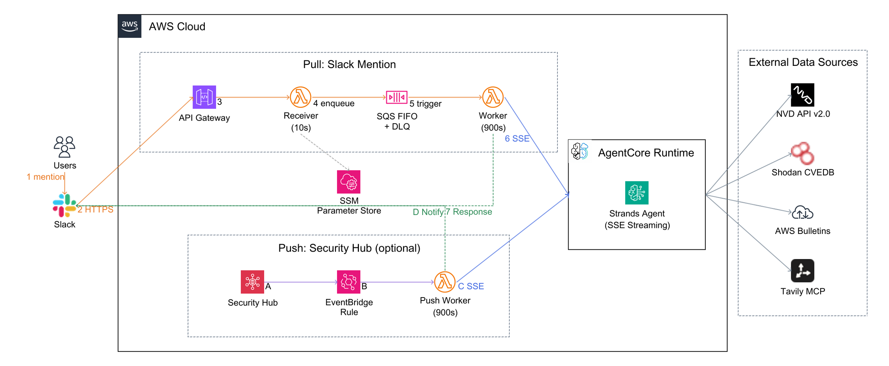

# Security Info Research Agent

セキュリティ脆弱性情報を複数ソースから横断的に調査し、Slack 上で対話的にレポートを提供する AI エージェント。

Amazon Bedrock AgentCore + Strands Agents SDK (TypeScript) + AWS CDK で構築。

## Architecture



## Tools

| ツール | データソース | 役割 |
|---|---|---|
| `nvd_lookup` | NVD API v2.0 | CVE の公式情報（CVSS, CWE, 影響製品） |
| `shodan_cve` | Shodan CVEDB | リスク指標の補完（EPSS, KEV, ランサムウェア） |
| `aws_bulletin` | AWS Security Bulletins RSS | AWS 固有のセキュリティ勧告 |
| `tavily_search` | Tavily MCP (Web検索) | ベンダー勧告・セキュリティブログの検索 |
| `tavily_extract` | Tavily MCP (Web取得) | Web ページの詳細情報取得 |

## Skills

| スキル | 発動条件 | 内容 |
|---|---|---|
| `security-investigation` | ユーザーが詳細調査を明示的に依頼 | 複数ソース横断調査 + 重要度判定 + 要約付きレポート |
| `analysis-template` | ユーザーが読み解きテンプレートを指示 | 7セクション構成の構造化分析 |
| `cve-prioritization` | 「優先度は」「SLA」「いつまでに対応」等の対応判断依頼 | CVE の対応優先度（P1-P5）と SLA 判定 |
| `sbom-analysis` | 依存関係リスト貼付 + 脆弱性確認依頼 | SBOM・依存関係からの脆弱パッケージ抽出 |
| `mitre-attack-mapping` | 「ATT&CK で分類」「TTP で整理」等の MITRE 分類依頼 | MITRE ATT&CK 戦術・技術 ID へのマッピング |

## Project Structure

```
security-info-research-agent/
|-- agent/                          # Agent (Strands Agents SDK)
|   |-- src/
|   |   |-- agent.ts                # Agent 定義 (System Prompt, Model, Tools)
|   |   |-- server.ts               # Express HTTP + SSE ストリーミング
|   |   |-- tools/                  # カスタムツール (NVD, Shodan, AWS Bulletin)
|   |   |-- schemas/                # Zod 入力スキーマ
|   |   |-- plugins/
|   |   |   +-- skills-plugin.ts    # Skills Plugin (Progressive Disclosure)
|   |   +-- skills/
|   |       |-- security-investigation/SKILL.md
|   |       |-- analysis-template/SKILL.md
|   |       |-- cve-prioritization/SKILL.md
|   |       |-- sbom-analysis/SKILL.md
|   |       +-- mitre-attack-mapping/SKILL.md
|   +-- Dockerfile                  # AgentCore Runtime 用 (ARM64)
|
|-- cdk/                            # AWS CDK
|   +-- lib/
|       +-- security-agent-stack.ts # Runtime + Gateway + Slack + EventBridge
|
|-- slack/                          # Slack 連携
|   |-- app-manifest.json           # Slack App マニフェスト
|   +-- lambda/
|       |-- receiver.ts             # 署名検証 + SQS 送信
|       |-- worker.ts               # AgentCore SSE -> Slack 投稿 (Pull)
|       |-- push-worker.ts          # Security Hub -> Slack 通知 (Push)
|       +-- shared.ts              # 共通処理 (Slack API, AgentCore 呼出し)
|
+-- memo/                           # 設計書・セッションレポート
```

## Prerequisites

- Node.js 24+
- Docker
- AWS CLI (認証済み)
- AWS CDK CLI (`npm install -g aws-cdk`)

## Setup

### 1. API キーの取得

| サービス | 取得先 | 必須 |
|---|---|---|
| Tavily | https://tavily.com | Yes |
| NVD | https://nvd.nist.gov/developers/request-an-api-key | Yes (レート制限緩和) |

### 2. SSM Parameter Store に登録

```bash
aws ssm put-parameter --name /security-agent/tavily-api-key \
  --type SecureString --value "<TAVILY_API_KEY>"

aws ssm put-parameter --name /security-agent/nvd-api-key \
  --type SecureString --value "<NVD_API_KEY>"
```

### 3. ローカル動作確認

```bash
cd agent
cp .env.example .env
# .env に API キーを記入
npm install
npx tsx src/agent.ts "CVE-2024-6387 の詳細を教えて"
```

### 4. CDK デプロイ

```bash
cd cdk
npm install
npx cdk bootstrap  # 初回のみ
npx cdk deploy
```

デプロイ完了後、出力される `RuntimeArn` を確認。

### 5. Slack App 設定

1. https://api.slack.com/apps -> 「Create New App」-> 「From a manifest」
2. `slack/app-manifest.json` の内容を貼り付けて作成
3. 「OAuth & Permissions」-> Bot User OAuth Token (`xoxb-...`) を取得
4. 「Basic Information」-> Signing Secret を取得
5. SSM に登録:

```bash
aws ssm put-parameter --name /security-agent/slack-bot-token \
  --type SecureString --value "xoxb-..."

aws ssm put-parameter --name /security-agent/slack-signing-secret \
  --type SecureString --value "<SIGNING_SECRET>"
```

6. 再デプロイ:

```bash
cd cdk && npx cdk deploy
```

7. 出力される `SlackApiUrl` を Slack App の Event Subscriptions -> Request URL に設定
8. Subscribe to bot events で `app_mention` を追加
9. App をワークスペースにインストール
10. Bot をチャンネルに招待: `/invite @Security Research Agent`

### 6. Security Hub Push 通知 (オプション)

```bash
npx cdk deploy -c enableSecurityHubPush=true -c slackChannel=C0123ABCDEF
```

## Agent Configuration

### Model

| 環境変数 | デフォルト | 説明 |
|---|---|---|
| `CACHE_STRATEGY` | `auto` | Prompt Caching 戦略 (`auto` / `anthropic`) |
| `MAX_TOKENS` | `4096` | 出力トークン上限 |

### Conversation Manager

| 環境変数 | デフォルト | 説明 |
|---|---|---|
| `WINDOW_SIZE` | `10` | 会話履歴の最大メッセージ数 |
| `TRUNCATE_RESULTS` | `true` | ツール結果の切り詰め |
| `SESSION_TTL_MS` | `1800000` | セッション有効期限 (30 分) |

## Slack での使い方

### 対話的な調査

```
User: @security-agent CVE-2024-6387
Bot:  CVE-2024-6387 (regreSSHion) の概要です。
      OpenSSH sshd のレースコンディション。CVSS 8.1 / EPSS 44.6%。

      何を深掘りしますか？
      - 影響範囲と対象バージョンの詳細
      - 対策手順（パッチ適用 / 緩和策）
      - 攻撃手法の技術的詳細
      - 全てを含む詳細レポート

User: @security-agent 対策を教えて
Bot:  OpenSSH 9.8p1 以降へのアップデートが根本対策です。
      緩和策として LoginGraceTime 0 の設定...
```

### 詳細レポート

```
User: @security-agent CVE-2024-6387 の詳細レポートを作成して
Bot:  [NVD API を検索中...]
      [Shodan CVEDB を検索中...]
      [Web 検索 を検索中...]
      report.md (スニペット添付)
```

### 読み解きテンプレート

```
User: @security-agent axios サプライチェーン攻撃を読み解きテンプレートで分析して
Bot:  [全7セクションの構造化レポート]
```

## Tech Stack

| レイヤー | 技術 |
|---|---|
| Agent SDK | @strands-agents/sdk 1.0.0-rc.3 |
| Model | Amazon Bedrock (Claude Sonnet 4.6 via inference-profile) |
| Runtime | Amazon Bedrock AgentCore Runtime (ARM64 Container) |
| IaC | AWS CDK (@aws-cdk/aws-bedrock-agentcore-alpha) |
| Slack 連携 | API Gateway + Lambda (Node.js 24) + SQS FIFO |
| Push 通知 | EventBridge + Lambda |
| シークレット管理 | SSM Parameter Store (SecureString) |
| MCP | Tavily MCP Server (stdio) |

## Design Decisions

| 決定事項 | 理由 |
|---|---|
| Receiver + Worker + SQS FIFO パターン | Slack 3 秒制約。Bolt lazy listener は Python 限定 + ap-northeast-1 RTT リスク |
| SSE ストリーミング | Worker Lambda がツール使用をリアルタイムに Slack 投稿するため |
| Skills Plugin (Progressive Disclosure) | 起動時はスキル名と説明だけ注入。発動時にフル指示をロードしトークン節約 |
| Prompt Caching (`auto`) | System Prompt + ツール定義をキャッシュしてコスト削減 |
| SlidingWindowConversationManager | 同一スレッド内の会話記憶。セッション TTL 30 分 |
| 長文はスニペット添付 | Slack の mrkdwn は標準 Markdown 非互換（テーブル, 見出し不可）。1500 文字超はファイル添付 |
| XML タグ + RFC 2119 でプロンプト構造化 | Anthropic 公式推奨。複雑な指示での精度が 12% 向上 |
